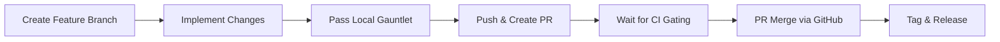

# Contributing to `rds-cli`

Thank you for your interest in contributing to `rds-cli`! As the official Command Line Interface for UC Riverside's CephRDS Research Data Service, we welcome contributions from UCR research computing team members, researchers, and external developers to improve performance, reliability, and security.

This document outlines the development workflow, coding standards, and procedures to get your changes integrated.

---

## 🏔️ Development Workflow

We strictly adhere to the **Skywalker Development Workflow** for all modifications. No direct commits to `main` are allowed.



### Step 1: Branch & Bump
1. Create a descriptively named branch from the latest `main`:
   ```bash
   git checkout -b feature/your-feature-name
   ```
2. Increment the package version in `pyproject.toml` immediately. We use standard [Semantic Versioning](https://semver.org/).

### Step 2: The Local Gauntlet
Before submitting any changes, you must ensure your local code satisfies our automated quality gates. **Do not submit a PR unless all of these checks pass locally:**

```bash
# 1. Lint & Auto-fix code issues
uv run ruff check . --fix

# 2. Verify strict code formatting
uv run ruff format .

# 3. Perform static type analysis
uv run mypy src

# 4. Run the entire test suite
uv run pytest
```

### Step 3: Push & Create PR
Commit your changes cleanly, push your branch, and create a Pull Request using the GitHub CLI:
```bash
git add .
git commit -m "feat(your-module): descriptive summary of changes"
git push -u origin feature/your-feature-name
gh pr create --fill
```

### Step 4: The Gatekeeper (CI/CD)
Once pushed, the automated GitHub Actions workflow will execute the local gauntlet suite on your code. Monitor the status of your PR checks:
```bash
gh pr checks --watch
```

### Step 5: Merge
Once all checks pass and the code is approved, merge the branch:
```bash
gh pr merge --merge --delete-branch
```
*Note: Do not merge branches locally via `git merge` unless specifically instructed.*

### Step 6: Tag & Release
Sync your local master, create the corresponding Git version tag, and draft the release on GitHub:
```bash
git checkout main
git pull origin main
git tag vX.Y.Z
git push origin vX.Y.Z
gh release create vX.Y.Z --title "vX.Y.Z" --notes "Brief release notes"
```

---

## 🎨 Coding Guidelines & Best Practices

1. **Strict Type Hinting:** All new functions and public APIs must be fully type-hinted. Check your code with `mypy` before proposing changes.
2. **Defensive Error Handling:** Never swallow exceptions or print raw tracebacks to researchers. Wrap boto3, S3, or GCS network actions inside robust try/except blocks. Provide meaningful help or fallbacks.
3. **Explicit Signal Propagation:** In Click or Typer CLI endpoints, do not let generic `except Exception` catch blocks swallow `typer.Exit` or `click.exceptions.Exit` signals. Always handle them explicitly:
   ```python
   except typer.Exit:
       raise
   except Exception as e:
       # Safe handling of general errors
   ```
4. **No Placeholders:** All code submitted must be complete and fully functional. Do not submit code containing `TODO` comments, incomplete logic, or mocked outputs unless part of a defined testing mock.
