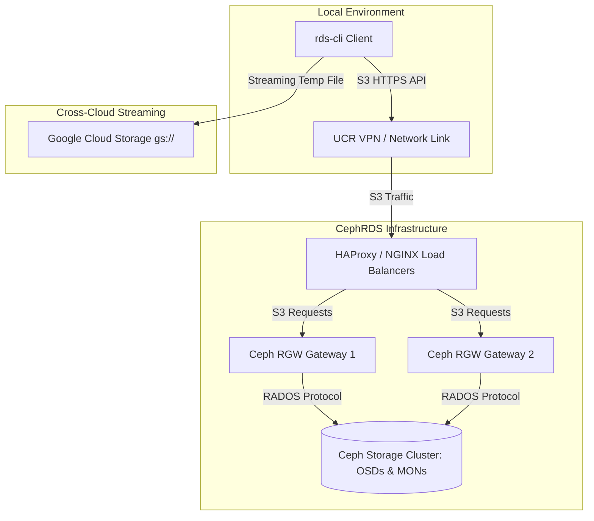

# CephRDS Command Line Interface (`rds-cli`)

[](https://www.python.org/downloads/release/python-3120/)
[](https://github.com/astral-sh/uv)
[](https://github.com/astral-sh/ruff)
[](#)

`rds-cli` is the official, enterprise-grade Command Line Interface for **CephRDS**, UC Riverside's 3.2 Petabyte S3-compatible Research Data Service. Built for modern high-performance research environments, `rds-cli` empowers researchers to upload, download, manage, and stream massive datasets with maximal throughput, network resilience, and strict security boundaries.

---

## 📐 Architecture & Connectivity

`rds-cli` communicates securely with the UC Riverside CephRDS storage architecture. It automatically handles load balancing, S3 API path-style translation, and seamless cross-cloud data streaming.



---

## 🚀 Key Features

* **⚡ High-Performance Concurrency:** Parallelizes directory transfers (recursive S3 uploads and downloads) using `concurrent.futures` multi-threading to bypass latency constraints over satellite networks (e.g., Starlink) and VPN tunnels.
* **🛡️ Failure Isolation:** Multi-threaded transfers are completely fault-tolerant. A single file error (lock, credential expiry, permissions) does not abort the queue; instead, it registers a clean summary of successes and failures upon completion.
* **🔑 Standard AWS Credentials Compatibility:** Operates as a drop-in replacement in pipelines, Jupyter Notebooks, or CI/CD tasks by automatically falling back to standard AWS environment variables (`AWS_ACCESS_KEY_ID`, `AWS_SECRET_ACCESS_KEY`, and `AWS_S3_ENDPOINT_URL`) when local custom keys are absent.
* **🔒 Directory Traversal Protection:** Implements strict path-resolution validation inside all recursive downloads to prevent malicious or accidental file writes outside of the designated destination directory.
* **🛑 Bounded listings:** Features S3 page-loop limits (`--limit`, defaulting to 1000) inside bucket listings to avoid memory exhaustion or terminal lockups when examining directories with millions of objects.
* **☁️ Cross-Cloud Copying:** Allows direct streaming of individual files between CephRDS (S3) and Google Cloud Storage (GCS) buckets.

---

## 📦 Installation & Upgrades

The recommended way to install `rds-cli` is globally on your system using [uv](https://github.com/astral-sh/uv), the ultra-fast Python package manager:

```bash
# Install globally from GitHub
uv tool install git+https://github.com/charles-forsyth/rds-cli.git
```

To upgrade `rds-cli` to the latest version in the future:
```bash
uv tool upgrade rds-cli
```

---

## 🔑 Authentication & Configuration

Before running commands, you must configure your access credentials.

### Method 1: Interactive Authentication (Recommended for Local Use)
Run the `auth` command and input your keys provided by UCR Research Computing:
```bash
rds-cli auth
```
*Your credentials will be saved securely under `~/.config/rds-cli/.env` with strict `0600` (read/write only by owner) file permissions.*

### Method 2: Standard Environment Variables (Recommended for Pipelines & Clusters)
Set standard AWS environment variables. `rds-cli` will automatically detect them:
```bash
export AWS_ACCESS_KEY_ID="your_access_key"
export AWS_SECRET_ACCESS_KEY="your_secret_key"
export AWS_S3_ENDPOINT_URL="https://rds.ucr.edu"
```

---

## 📖 Command Reference

| Command | Usage | Description |
| :--- | :--- | :--- |
| **`auth`** | `rds-cli auth` | Interactively configure S3 Access Key, Secret Key, and Endpoint. |
| **`bucket-info`** | `rds-cli bucket-info -b <bucket>` | Retrieve total object count, bucket size, quota, and percentage usage. (Deprecated alias: `info`). |
| **`file-info`** | `rds-cli file-info <key> -b <bucket>` | Fetch file sizes, creation timestamps, and custom metadata. (Deprecated alias: `stat`). |
| **`ls`** | `rds-cli ls [-b <bucket>] [-p <prefix>] [-l <limit>]` | List available buckets, prefix objects, or paths with safety limits. (Alias: `list`). |
| **`upload`** | `rds-cli upload <path> -b <bucket> [-k <key>] [-m k=v] [--multipart]` | Upload local files or folders recursively with concurrent task queues. |
| **`download`**| `rds-cli download <key> -b <bucket> [-d <dest>] [-r]` | Download single objects or entire S3 prefix structures concurrently. |
| **`cp`** | `rds-cli cp <src> <dest> [-r] [--multipart]` | Copy files between Local, CephRDS (`s3://`), and GCS (`gs://`). (Alias: `copy`). |
| **`mv`** | `rds-cli mv <src> <dest> [-r]` | Move files programmatically, automatically cleaning up source on success. (Alias: `move`). |
| **`rm`** | `rds-cli rm <key> -b <bucket> [-r]` | Delete individual files or chunked prefixes (handles up to 1000 keys per call). (Aliases: `delete`, `remove`). |
| **`share`** | `rds-cli share <key> -b <bucket> [-e <secs>]` | Generate cryptographically signed, expiring public links. |

---

## 💡 Practical Examples

### 📊 Storage Auditing & Monitoring
Retrieve bucket statistics and usage quota:
```bash
rds-cli bucket-info -b neuroscience-imaging
```

List up to 500 files inside a specific directory:
```bash
rds-cli ls -b neuroscience-imaging -p study_2/ -l 500
```

List all files without limits (use caution on massive buckets):
```bash
rds-cli ls -b neuroscience-imaging -l -1
```

### 📤 Concurrent Uploads with Custom Metadata
Recursively upload raw dataset directories and tag them with project details:
```bash
rds-cli upload ./raw_images/ -b neuroscience-imaging -k projects/raw_study/ -m owner=forsythc -m type=experimental
```

Force multipart uploads for huge dataset tarballs (>1GB) to bypass satellite jitter:
```bash
rds-cli upload raw_data.tar.gz -b neuroscience-imaging --multipart
```

### 📥 Isolated Concurrent Downloads
Recursively sync a remote S3 directory to your local workstation:
```bash
rds-cli download projects/raw_study/ -b neuroscience-imaging -r -d ./local_study_dir/
```

### ☁️ Cross-Cloud Data Migrations (CephRDS <-> GCS)
Stream an object directly from CephRDS (`s3://`) to Google Cloud Storage (`gs://`):
```bash
rds-cli cp s3://neuroscience-imaging/raw_data.pt gs://ucr-gcs-research-bucket/raw_data.pt
```

Stream an object from Google Cloud Storage back to CephRDS:
```bash
rds-cli cp gs://ucr-gcs-research-bucket/experiment.h5 s3://neuroscience-imaging/experiment.h5
```

---

## 🛠️ Developer Guide (Skywalker Workflow)

All code modifications are strictly gated under **The Skywalker Development Workflow**:

1. **Branch & Bump:** Always develop inside dedicated feature branches (`feature/name`) and increment the version in `pyproject.toml` immediately.
2. **The Local Gauntlet:** Before proposing changes, ensure the entire test suite, linting, and formatting checks are 100% successful:
   ```bash
   # 1. Lint & Autofix
   uv run ruff check . --fix
   # 2. Code Formatting
   uv run ruff format .
   # 3. Static Type Analysis
   uv run mypy src
   # 4. Running Test Suites
   uv run pytest
   ```
3. **Commit & Pull Requests:** Commit files cleanly, push to remote origin, and generate pull requests via GitHub CLI (`gh pr create --fill`).
4. **Merge & Tag:** Merge pull requests via GitHub (`gh pr merge --merge --delete-branch`), pull latest `main`, tag the version `git tag vX.Y.Z`, and trigger an official release.

---

### Support

For accounts, access keys, or storage quotas, contact **UCR Research Computing**.
